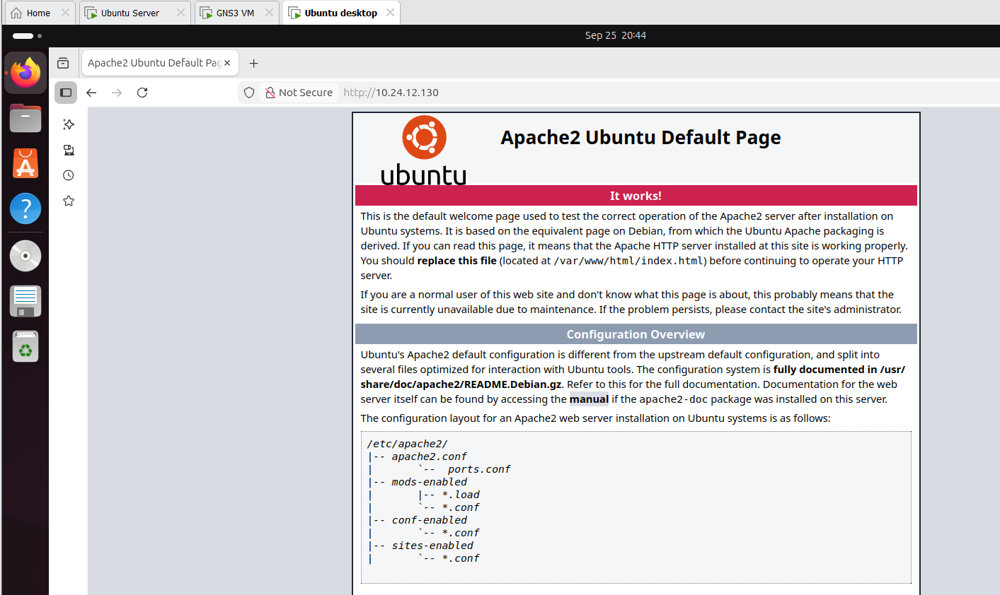
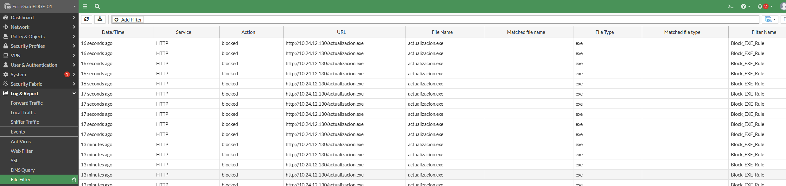
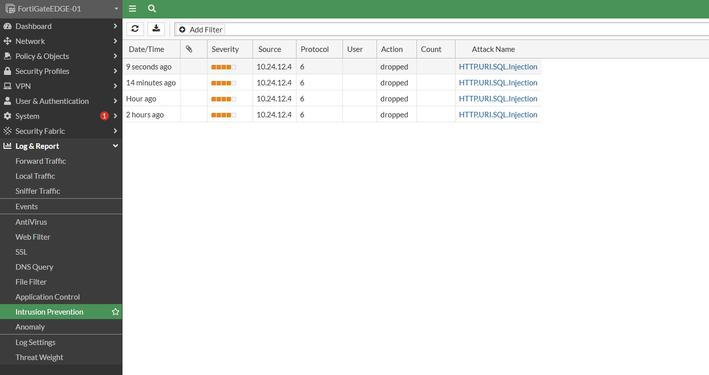
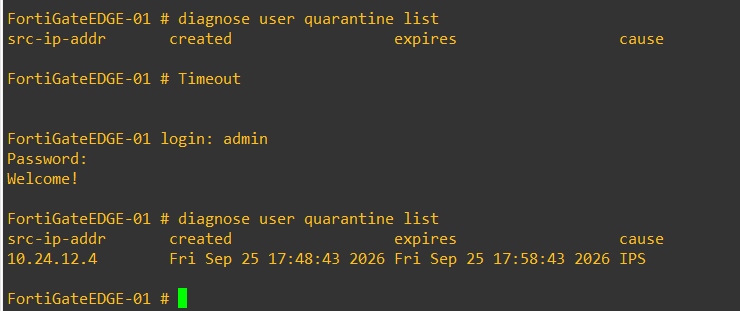
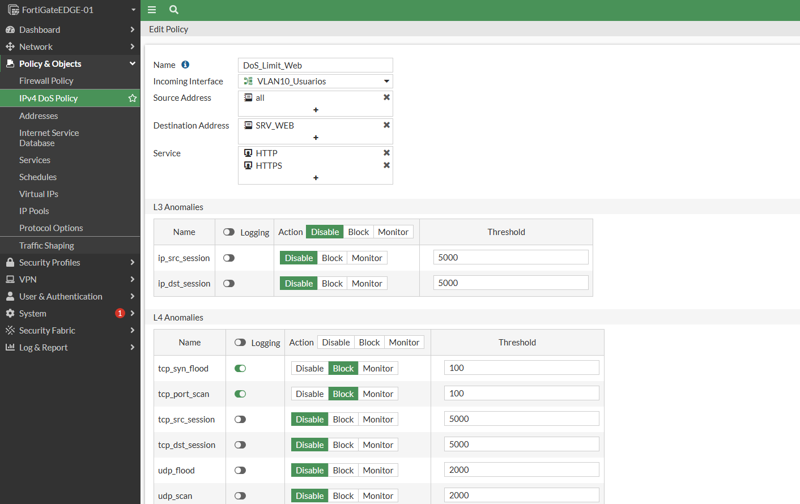

# Laboratorio de Seguridad en Redes: FortiGate NGFW & Cisco Switching L2

---

## 🎥 Video Demostrativo
> **Enlace del video:** Video Demostrativo en OneDrive https://itlaedudo-my.sharepoint.com/:v:/g/personal/20242412_itla_edu_do/IQCkfjkszioPSoJxz6L7oQPQAd6biLT8Mdrpp6o2jJQOSfE?nav=eyJyZWZlcnJhbEluZm8iOnsicmVmZXJyYWxBcHAiOiJPbmVEcml2ZUZvckJ1c2luZXNzIiwicmVmZXJyYWxBcHBQbGF0Zm9ybSI6IldlYiIsInJlZmVycmFsTW9kZSI6InZpZXciLCJyZWZlcnJhbFZpZXciOiJNeUZpbGVzTGlua0NvcHkifX0&e=3Vvw8h  
> *Demostración práctica de cumplimiento de seguridad perimetral (máximo 10 minutos) con rostro visible, voz audible y fecha/hora del sistema.*

---

## 🎯 Propósito del Laboratorio
Diseñar, configurar y validar una infraestructura de seguridad en redes multicapa integrando un firewall de nueva generación (**FortiGate NGFW**) y un switch de acceso (**Cisco vIOS-L2**). 

Se implementa una política perimetral estricta de mínimo privilegio, segmentación lógica mediante VLANs, seguridad en capa de enlace (*Port-Security*), inspección profunda (DPI), prevención de intrusiones (IPS) con aislamiento automático de atacantes en cuarentena, filtrado de archivos ejecutables maliciosos y mitigación de ataques volumétricos de denegación de servicio (DoS Rate Limiting).

---

## 📐 Topología del Entorno
```
+-----------------------------------+
                     |      WAN / Red Externa (NAT)      |
                     +-----------------------------------+
                                       | (Port1: 192.168.186.130)
                            +---------------------+
                            |   FortiGate NGFW    |
                            |   (FortiOS 7.0.9)   |
                            +---------------------+
                                       | (Port2 Troncal 802.1Q)
                                       |
                                       | (Gi0/0 Troncal)
                            +---------------------+
                            |  Switch Cisco L2    |
                            |     (vIOS-L2)       |
                            +---------------------+
                               |               |
                (Gi0/2 - Access|               |(Gi0/1 - Access
                       VLAN 10)|               |       VLAN 20)
                               |               |
                +------------------+       +-------------------------------+
                |  Ubuntu Desktop  |       |  Ubuntu Server (Dual-IP)      |
                |  Cliente VLAN 10 |       |  - Web Server: 10.24.12.130   |
                |  (10.24.12.4)    |       |  - DB Server:  10.24.12.131   |
                +------------------+       +-------------------------------+

                ## 🔢 Direccionamiento IP (Matrícula 2024-2412)  ```

El cálculo VLSM se estructuró a partir del identificador de matrícula **2024-2412**:

| Segmento / VLAN | Función | Red / Máscara | Gateway (FortiGate) | Hosts Asignados |
| :--- | :--- | :--- | :--- | :--- |
| **VLAN 10** | Segmento Usuarios | `10.24.12.0/25` | `10.24.12.1` | `10.24.12.4` (DHCP Dinámico) |
| **VLAN 20** | Segmento Servidores | `10.24.12.128/28` | `10.24.12.129` | Web: `10.24.12.130`<br>DB: `10.24.12.131` |
| **Port 1** | WAN / Administración | `192.168.186.0/24` | `192.168.186.2` | `192.168.186.130` (GUI FortiGate) |

---

## 🛠️ Configuraciones Implementadas

### 1. Conmutación y Seguridad Básica L2 (Cisco vIOS-L2)
* **VLANs:** Creación de VLAN 10 (`USUARIOS`) y VLAN 20 (`SERVIDORES`).
* **Troncal 802.1Q:** Configurado en `Gi0/0` permitiendo exclusivamente el paso de las VLANs 10 y 20 hacia el FortiGate.
* **Seguridad de Puertos (Port-Security):**
  * Activado en la interfaz `Gi0/2` con aprendizaje adhesivo (`mac-address sticky`).
  * Modo de violación `restrict` (bloqueo y contadores de violación sin deshabilitar la interfaz por falsos positivos de hipervisor).
  * Optimización STP: `spanning-tree portfast` y `bpduguard enable`.

### 2. Políticas de Firewall y Ruteo (FortiGate NGFW)
* **Subinterfaces 802.1Q:** `VLAN10_Usuarios` y `VLAN20_Servers` alojadas en `port2`.
* **Servidor DHCP:** Desplegado en la subinterfaz de VLAN 10 para la entrega automática de parámetros de red a clientes.
* **Política 1 (Allow_Users_to_Web):** Permite el tráfico saliente de `VLAN10_Usuarios` a `VLAN20_Servers` únicamente hacia el servidor web (`10.24.12.130`) en los servicios HTTP y HTTPS (443).
* **Política 2 (Deny_Users_to_DB):** Regla de bloqueo explícito de Usuarios hacia el servidor de base de datos (`10.24.12.131`) en el puerto MySQL 3306 con generación de logs.
* **Política Inter-Servidores (Allow_Web_to_DB_3306):** Restricción de tráfico para que el servidor Web solo interactúe con el DB Server por el puerto 3306.

### 3. Perfiles de Seguridad UTM
* **Inspección Profunda SSL (DPI):** Inspección de certificados aplicada en las directivas de seguridad para análisis de contenido web.
* **Sistema de Prevención de Intrusiones (IPS):** Firma personalizada `HTTP.URI.SQL.Injection` configurada con acción `drop`, registro detallado y aislamiento automático del atacante en lista de **cuarentena por 10 minutos**.
* **Filtrado de Archivos (File Filter):** Perfil `Block_EXE` con inspección binaria de cabeceras Windows PE/MZ de 512 bytes, bloqueando transferencias HTTP y generando eventos de seguridad.
* **Rate Limiting DoS:** Política IPv4 DoS con mitigación activa para inundaciones `tcp_syn_flood`.

---

## 🧪 Pruebas de Validación y Evidencias

### 1. Acceso Web Autorizado y Bloqueo al DB Server
* **Acceso HTTP/HTTPS:** Validación de carga correcta del servidor Apache2 desde el cliente en `http://10.24.12.130`.
* **Bloqueo de Puerto 3306:** Ejecución de `nc -zvw3 10.24.12.131 3306` resultando en timeout y registro de rechazo en **Log & Report > Forward Traffic**.



---

### 2. Bloqueo de Descarga de Ejecutables (.exe)
* Solicitud de descarga del archivo `http://10.24.12.130/actualizacion.exe`.
* El motor de *File Filter* analiza los primeros bytes del binario PE y cancela inmediatamente la conexión (`TCP RST`).
* Registro verificado en **Log & Report > File Filter** bajo la regla `Block_EXE_Rule`.



---

### 3. Detección de SQL Injection y Cuarentena del Atacante (IPS)
* Inyección de payload malicioso en la URL: `http://10.24.12.130/?id=1'%20UNION%20SELECT%201,2,3--`.
* El sensor IPS detecta la anomalía, descarta los paquetes (`dropped`), genera el registro en **Log & Report > Intrusion Prevention** y bloquea la IP del cliente (`10.24.12.4`) durante 10 minutos.




---

### 4. Mitigación DoS (Rate Limiting)
* Configuración en **IPv4 DoS Policy** estableciendo umbrales de paquetes para mitigar ataques de denegación de servicio por SYN Flood.



---

## 📁 Estructura del Repositorio
* `/configs`: Configuraciones exportadas (`cisco_switch_running_config.txt` y `fortigate_running_config.conf`).
* `/scripts`: Scripts de generación binaria (`generate_pe_exe.py`) y servicio DB (`start_db_service.sh`).
* `/img`: Evidencias gráficas del laboratorio.

